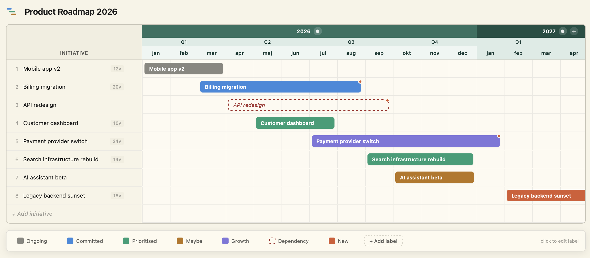

# Roadmap

A native macOS app for interactive product roadmaps. Built with Tauri 2 (Rust + WebView).



## Download

Grab the latest release from the [Releases page](https://github.com/sievertz/roadmap-app/releases/latest). Drag Roadmap.app to Applications.

Built for Apple Silicon (M1/M2/M3/M4). Open an issue if you need an Intel build.

### First launch (important)

The app is not Apple-signed. On macOS Sequoia and newer, Gatekeeper will show a `"Roadmap" is damaged and can't be opened` error and refuse to launch it, even via right-click → Open.

To fix this, run the following in Terminal once:

```bash
xattr -dr com.apple.quarantine /Applications/Roadmap.app
```

After this you can open the app normally by double-clicking. The command only needs to be run once per install, and once per future major update. Auto-updates from inside the app are not affected.

Why this happens: macOS marks downloaded files as quarantined and requires either an Apple Developer signature or this manual override before they can run.

## Features

### Editing
- Click an initiative name to open details, double-click to rename inline
- Drag a bar to move it in time, drag its edges to resize, drag the row number to reorder
- Delete an initiative via the × that appears on row hover
- Undo and redo (Cmd+Z / Cmd+Shift+Z) for every destructive action
- Roadmap title editable separately from filename (click the heading at the top)
- Custom logo per roadmap: click the logo to pick an emoji or upload an image (PNG/JPG/SVG/GIF/WebP, max 500 KB)
- Editable legend with colour picker, custom categories

### Edit modal
- Category (with colour swatch showing the selected category's colour), dev weeks estimate, JIRA link (with open-in-browser button), dependencies, description
- Bars with the dependencies field set show a small orange dot indicator
- Cmd+Enter applies, Esc cancels

### Timeline
- Month-level Gantt with year/quarter/month bands
- Add or remove years dynamically
- Click the pencil on a year band to attach notes for that year
- Search box in the INITIATIVE header filters rows live

### Files and windows
- Multi-window: each .roadmap file opens in its own window
- File association: double-clicking a .roadmap file in Finder opens the app
- Auto-save with debounce to disk
- Opening an already-open file focuses the existing window
- Welcome view with recent files, auto-opens the most recent file on startup
- Label column auto-fits to the longest initiative name on file open
- Recents list filters out files that have been deleted from disk

### Export and distribution
- SVG export for presentations (vector, scales infinitely, matches current theme)
- HTML export
- Cmd+P opens the macOS print dialog with a clean print layout
- Auto-updater pulls new versions from GitHub Releases on app start

### Appearance
- Light and dark mode, follows system by default
- Manual override under View → Appearance
- Warm paper-tone light palette
- Responsive row heights for large displays
- Floating legend that stays visible while scrolling

## Prerequisites

On your Mac:

```bash
# Rust toolchain
curl --proto '=https' --tlsv1.2 -sSf https://sh.rustup.rs | sh

# Node.js 20+
brew install node

# Xcode Command Line Tools
xcode-select --install
```

## First-time setup

```bash
cd roadmap-app
npm install
```

Installs the Tauri CLI and frontend dependencies. Takes a few minutes the first time.

## Dev mode

```bash
npm run tauri dev
```

Starts the app with hot reload for frontend changes. The first run compiles the Rust code in 2-5 minutes, after that the app starts in seconds.

## Release build

```bash
npm run tauri build
```

Output:

- `src-tauri/target/release/bundle/macos/Roadmap.app`
- `src-tauri/target/release/bundle/dmg/Roadmap_0.1.0_aarch64.dmg`

Takes 3-10 minutes depending on incremental cache.

Universal binary (Intel + Apple Silicon):

```bash
rustup target add x86_64-apple-darwin
npm run tauri build -- --target universal-apple-darwin
```

## Releasing a new version

GitHub Actions builds and signs releases automatically when you push a git tag. The local build is only a sanity check that the code compiles.

```bash
cd ~/Projects/roadmap-app

# Bump version in three files: package.json, src-tauri/Cargo.toml, src-tauri/tauri.conf.json
# Then verify the build compiles:
npm run tauri build 2>&1 | tail -5

# Commit, tag and push
git add .
git commit -m "Release vX.Y.Z: brief description"
git tag vX.Y.Z
git push origin main --tags
```

GitHub Actions then:

1. Builds and signs the release using TAURI_SIGNING_PRIVATE_KEY and TAURI_SIGNING_PRIVATE_KEY_PASSWORD secrets stored in repo settings
2. Creates a draft release with .dmg, .app.tar.gz, .sig and latest.json attached

Then on GitHub: open the draft, add release notes, click Publish. Auto-updaters on existing installations pick up the new version the next time the app starts.

## Menu shortcuts

| Shortcut | Action |
|---|---|
| Cmd+N | New window |
| Cmd+O | Open file |
| Cmd+W | Close window |
| Cmd+S | Save |
| Cmd+Shift+S | Save As |
| Cmd+Shift+E | Export as HTML |
| Cmd+Shift+P | Export as SVG |
| Cmd+P | Print |
| Cmd+Z | Undo |
| Cmd+Shift+Z | Redo |
| Cmd+/ | Keyboard shortcuts cheat sheet |

Cmd+Enter applies in any modal, Esc closes it.

## Distribution and signing

The .dmg is currently unsigned by Apple. Recipients need to run the xattr command from the [First launch](#first-launch-important) section once after installing.

For frictionless distribution without the xattr step, you need an Apple Developer account (around USD 99 per year) plus a Developer ID certificate. Not currently set up for this project.

### One-time setup

1. Sign up for an Apple Developer account at `https://developer.apple.com/programs/`
2. Generate a Developer ID Application certificate in the portal
3. Install the certificate in Keychain
4. Note your Team ID

### Configure signing in tauri.conf.json

```json
"macOS": {
  "signingIdentity": "Developer ID Application: Your Name (TEAMID)",
  "providerShortName": null,
  "entitlements": null
}
```

### Notarisation

```bash
export APPLE_ID="you@example.com"
export APPLE_PASSWORD="app-specific-password"
export APPLE_TEAM_ID="TEAMID"
npm run tauri build
```

Tauri notarises automatically when these env vars are set.

## Auto-updater

Active. The app checks for new versions on each launch and prompts users to install when one is available.

How it works:

1. App pings `https://github.com/sievertz/roadmap-app/releases/latest/download/latest.json` on startup
2. If the JSON contains a newer version than the installed one, an update modal opens with a link to release notes
3. On Install, the app downloads the new .app.tar.gz, verifies its signature against the public key embedded in tauri.conf.json, unpacks it and relaunches

GitHub Actions handles signing automatically via repository secrets (`TAURI_SIGNING_PRIVATE_KEY` and `TAURI_SIGNING_PRIVATE_KEY_PASSWORD`). See the [Releasing a new version](#releasing-a-new-version) section above.

Users can also manually trigger a check via Help → Check for Updates….

## Project structure

```
roadmap-app/
├── index.html              Frontend entry
├── src/
│   ├── main.js             Frontend logic, drag-and-drop, SVG export, Tauri API
│   └── styles.css          UI styling, light/dark mode variables
├── src-tauri/
│   ├── src/
│   │   ├── main.rs         Entry point (calls lib::run)
│   │   ├── lib.rs          Tauri builder, plugin setup, command registration
│   │   ├── commands.rs     File IO, dialogs, recent files, open_external
│   │   └── menu.rs         Native macOS menu and event dispatch
│   ├── icons/              App icons (PNG, ICNS, ICO)
│   ├── capabilities/       Per-window permissions
│   ├── Cargo.toml          Rust dependencies
│   ├── build.rs            Build script
│   └── tauri.conf.json     App config (name, bundle id, icons, updater)
├── package.json
├── vite.config.js
└── README.md
```

## File format

.roadmap files are JSON with this structure:

```json
{
  "v": 6,
  "config": {
    "startYear": 2026,
    "startMonth": 1,
    "endYear": 2027,
    "endMonth": 12,
    "labelColumnWidth": 220,
    "title": "Product Roadmap 2026",
    "logo": "🚀",
    "yearNotes": {
      "2026": "Notes about this year"
    }
  },
  "initiatives": [
    {
      "id": "...",
      "label": "Initiative name",
      "position": { "s": 0, "e": 5 },
      "type": "committed",
      "weeks": 4,
      "jira": "https://...",
      "dependencies": "team Andromeda",
      "description": "...",
      "adjustable": true,
      "dashed": false
    }
  ],
  "legend": [
    { "id": "committed", "label": "Committed", "color": "#378ADD" }
  ],
  "savedAt": "2026-05-20T12:00:00.000Z"
}
```

Optional config fields:

- `title`: display name shown in the title bar, independent of the filename. Falls back to filename without extension if not set
- `logo`: either a `data:image/...;base64,...` URL or a short emoji string (e.g. `🚀`). Falls back to the default SVG logo if not set
- `yearNotes`: object mapping year strings to notes text

The schema version (`v` field) is used for migration when reading older files.

## Common problems

### "Failed to compile" on first run
Most likely missing Xcode Command Line Tools. Run `xcode-select --install`.

### App does not start in dev mode
Port 1420 is occupied. Run `lsof -i:1420` and stop the process, or change the port in vite.config.js and tauri.conf.json.

### Build fails with icon error
Regenerate the icon set: `npm run tauri icon ./src-tauri/icons/icon.png`

### Permission denied when pushing to GitHub over SSH
The SSH key is missing locally or has not been uploaded to `https://github.com/settings/keys`.
